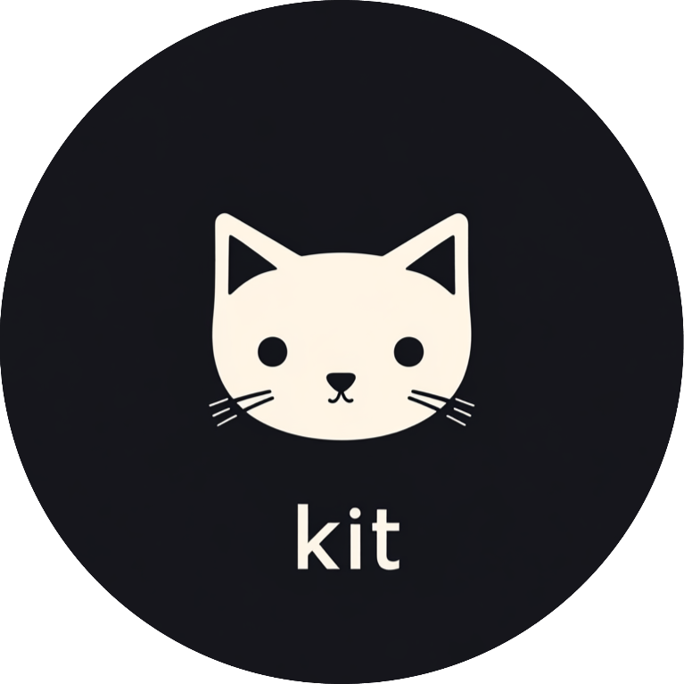

# kit.py

<div align="center">
  
</div>

*the tiny class-based python api framework*

```python
import kit

k = kit.New()

class Hello:
    def GET(self, request, name):
        return kit.json_response({"hello": name})

if __name__ == "__main__":
    k.run()
```
